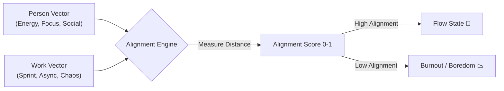

# continuum-protocol
> **Aligning people and work by rhythm, not resumes.**

[](README.kr.md)
[]()
[](https://github.com/DevAaronJeong/continuum-protocol/issues)

## ⚡ TL;DR (What is this?)
* **A Protocol:** Matches people/work using dynamic *lifestyle vectors* (energy, focus, variance).
* **No Resumes:** Replaces static skills ("Python", "Excel") with rhythmic compatibility.
* **Philosophy:** Work is a temporary state. Consistency is effort. There are no "bad" jobs, only misalignments.

---

## 🌊 The Concept Visualized

We are moving from **Static Matching** to **Dynamic Alignment**.



(Note: GitHub supports Mermaid diagrams natively now. If it doesn't render, we use ASCII below)

```
       Person (P)           Match Quality          Work (W)
      [ Energy ]                 |                [ Sprint ]
      [ Focus  ]  ------------> [0-1] <----------- [ Async  ]
      [ Social ]                 |                [ Chaos  ]
      
      1.0 = Perfect alignment right now
      0.0 = Complete mismatch
      
      Success != Long employment
      Success == Good fit at this moment
```

---

## 📐 The Math (Conceptual Model)

**Important:** This uses weighted distance-based alignment, not cosine similarity.

We model Humans ($H$) and Work ($W$) as vectors with multiple dimensions:

$$H = (h_1, h_2, h_3, ..., h_n)$$
$$W = (w_1, w_2, w_3, ..., w_n)$$

Where each dimension represents a lifestyle attribute (energy rhythm, flexibility, etc.).

**Alignment Score** is calculated as:

$$Alignment = 1 - \sum_{i=1}^{n} \alpha_i \cdot |h_i - w_i|$$

Where:
- $\alpha_i$ = weight for dimension $i$ (all weights sum to 1)
- $|h_i - w_i|$ = absolute difference for dimension $i$

**Why this approach?**
1. **Interpretable**: Each dimension contributes independently
2. **Natural scaling**: Automatically produces scores in [0, 1]
3. **Tunable**: Easy to adjust dimension weights
4. **Explainable**: We can show exactly which dimensions align/misalign

**Time-awareness:**

$$Alignment(t) = f(H(t), W(t), Context(t))$$

The key insight: Alignment is calculated at a specific moment $t$, acknowledging that both people and work evolve over time.

💻 **See the Code:** Check `src/alignment_engine.py` for the actual implementation with detailed comments.

---

## 🧘 Manifesto & Philosophy

1. **Lifestyle has no hierarchy.** (Night owls $\neq$ Lazy)
2. **Consistency is effort.** (Maintaining rhythm > Burning out)
3. **Work is a role, not an identity.** (You step in, you step out)
4. **Leaving is not failure.** (It's just a state change)

📖 Read the full [MANIFESTO](MANIFESTO.md).

---

## 🧪 Open Experiments (Join us)

This project is intentionally incomplete. We need your brain on:

* **Philosophy:** How to match without surveillance?
* **Engineering:** Privacy-preserving lifestyle profiling?
* **Design:** Making this feel natural, not dystopian?
* **Ethics:** Defining the undefined.

### How to Contribute

* **Think:** Read the [Manifesto](MANIFESTO.md).
* **Discuss:** Comment on [Issues](https://github.com/DevAaronJeong/continuum-protocol/issues).
* **Code:** Tweak the `prototype.py` parameters.

---

## ⚠️ Ethics First

**If this system becomes a surveillance tool, it has failed.**

We are currently debating which license best protects this mission (e.g., Hippocratic License).

📄 See our [Ethics & Privacy Guidelines](docs/ethics-privacy.md).

---

## 📂 Repository Structure
```
continuum-protocol/
├── README.md                       # You are here
├── README.kr.md                   # Korean version
├── MANIFESTO.md                   # Core philosophy
├── docs/
│   ├── ethics-privacy.md          # Privacy & ethical principles
│   ├── why-not-job-board.md       # How this differs from job boards
│   ├── open-questions.md          # Unresolved questions (help us!)
│   └── roadmap.md                 # Future direction
├── src/
│   └── alignment_engine.py        # Core alignment logic (conceptual)
├── examples/
│   ├── simple_match.py            # Basic alignment demo
│   ├── batch_alignment_demo.py    # Multiple options matching
│   └── synthetic_data.py          # Test data generator
├── .github/
│   └── ISSUE_TEMPLATE/            # Issue templates
└── requirements.txt               # Dependencies (currently none)
```

---

## 🚀 Quick Start

### Try the Demo
```bash
# Clone the repo
git clone https://github.com/DevAaronJeong/continuum-protocol.git
cd continuum-protocol

# Run the main alignment demo
python src/alignment_engine.py

# Try batch matching
python examples/batch_alignment_demo.py

# Generate synthetic test data
python examples/synthetic_data.py
```

---

## 🐍 Why Python?

**This is not a machine learning project.**

Python is used here for:
- **Readability**: Code should be understandable, not optimized
- **Accessibility**: Most developers can read and critique it
- **Prototyping**: Quick iteration on conceptual ideas

These experiments prioritize **clarity over performance**. If this were production code, language choice would matter. But since this is exploratory research, Python's expressiveness is more valuable than its speed.

---

## 🧪 Code Experiments

This repository includes small, self-contained Python experiments.  
**They are not implementations of a product**, but explorations of how alignment could be expressed in code.

### Available Experiments

**`src/alignment_engine.py`**  
A minimal model of people and work as lifestyle vectors, and how their alignment might be compared.
- Run: `python src/alignment_engine.py`
- Purpose: Demonstrate the core concept in executable form
- Status: Conceptual prototype (not production-ready)

**`examples/simple_match.py`**  
Basic example showing two scenarios: good alignment vs. poor alignment.
- Run: `python examples/simple_match.py`
- Purpose: Show how the same logic produces different results based on rhythm compatibility

**`examples/batch_alignment_demo.py`**  
Example of how one person's profile could be matched against multiple work opportunities.
- Run: `python examples/batch_alignment_demo.py`
- Purpose: Illustrate that rankings are contextual, not absolute

**`examples/synthetic_data.py`**  
Generate fake lifestyle profiles for testing.
- Run: `python examples/synthetic_data.py`
- Purpose: Create test data without needing real user information

### What These Experiments Are NOT

❌ Production-ready code  
❌ AI/ML implementations  
❌ Hiring tools  
❌ Complete solutions  

### What These Experiments ARE

✅ Thought experiments in code form  
✅ Invitations to critique and improve  
✅ Starting points for exploring "work as a state"  
✅ Demonstrations of explainability (always show "why")  

### Feedback Welcome

These experiments are intentionally incomplete. If you see:
- Flawed assumptions
- Missing dimensions
- Better approaches
- Ethical concerns

Please open an issue. Critique is more valuable than praise.

---

### Read the Docs

📖 **New to the project?**
1. Start with [MANIFESTO.md](MANIFESTO.md) - Core philosophy
2. Read [docs/why-not-job-board.md](docs/why-not-job-board.md) - How this is different
3. Check [docs/ethics-privacy.md](docs/ethics-privacy.md) - Privacy principles

🤔 **Have concerns or questions?**
- See [docs/open-questions.md](docs/open-questions.md)
- Open an issue tagged `philosophy` or `ethics`

🛠️ **Want to contribute?**
- Read [CONTRIBUTING.md](CONTRIBUTING.md)
- Check [docs/roadmap.md](docs/roadmap.md)

---

## 🔮 Future Experiments (Open Questions)

These are intentionally undefined. We don't have answers yet.

### Potential Explorations

**Temporal Alignment**
- How does alignment change over time?
- When should the system suggest re-evaluation?
- Can we predict alignment drift?

**Exit Conditions**
- What signals indicate alignment is degrading?
- How do we distinguish "temporary rough patch" from "fundamental mismatch"?
- When should departure be suggested?

**Non-Numeric Representations**
- Can rhythm be captured without quantification?
- Are there lifestyle dimensions we're missing?
- How do we model cultural or contextual factors?

**Organizational Profiling**
- How do we measure a company's actual rhythm (not claimed culture)?
- Can team dynamics be vectorized ethically?
- What prevents gaming the system?

**Privacy-Preserving Matching**
- Federated learning approaches?
- Differential privacy in alignment scores?
- User-controlled profiling granularity?

---

## 🤔 FAQ

**Q: Is this a job board?**  
A: No. This is a protocol for modeling alignment between lifestyles.

**Q: Can I use the code?**  
A: Yes, but it's a conceptual prototype. Don't use it for production without significant development.

**Q: Why is the code so simple?**  
A: By design. This is exploratory, not optimized. Complexity would obscure the core idea.

**Q: What's missing?**  
A: Almost everything. Privacy implementation, real data collection, validation, scale, UI, etc. See [docs/open-questions.md](docs/open-questions.md).

**Q: Where should I start?**  
A: Read [MANIFESTO.md](MANIFESTO.md) first, then run `python src/alignment_engine.py`.

**Q: Why Python and not [other language]?**  
A: Readability over performance. This is research, not production. See [Why Python?](#-why-python) section above.

---

## 💬 Community

* **Discussions:** [GitHub Discussions](https://github.com/DevAaronJeong/continuum-protocol/discussions)
* **Philosophy Questions:** Tag with `philosophy`
* **Technical Questions:** Tag with `technical`

---

## 🙏 Acknowledgments

This project stands on the shoulders of:
* **Ambient Intelligence** research
* **Human-Computer Interaction** ethics
* **Anti-hustle** movement
* Everyone questioning traditional employment models

---

**This is not a job board.**  
**This is a system for honoring transitions.**

---

*Last updated: 2025*
