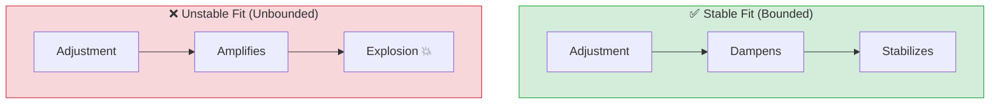
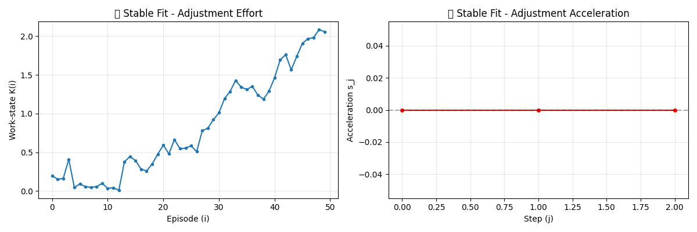
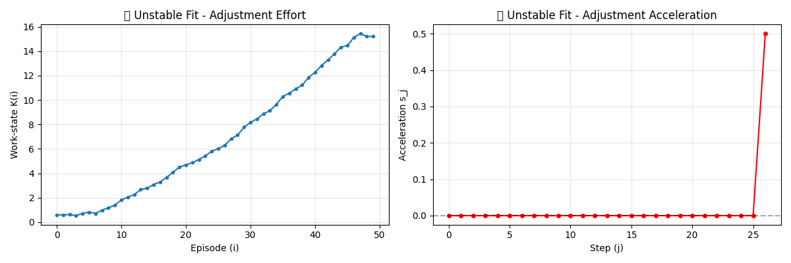
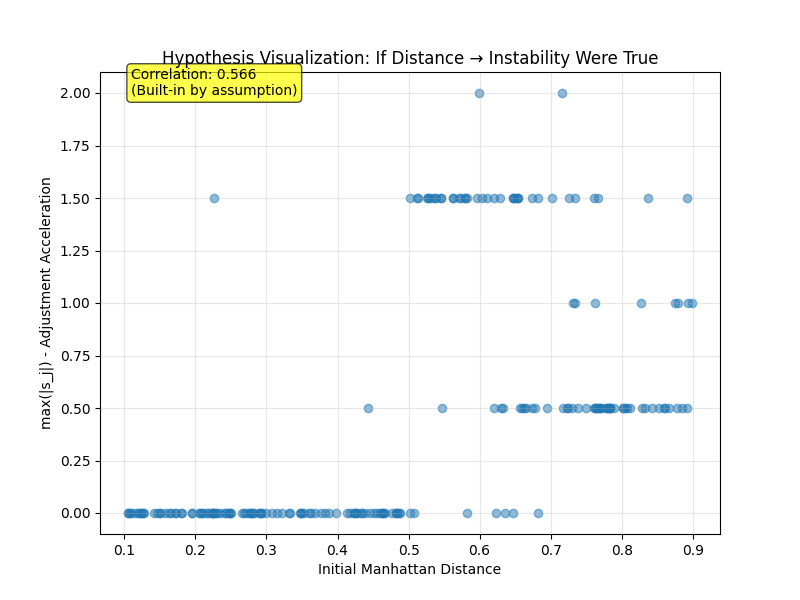

# Theory: Fit as Dynamic Stability

> **Note:** The core mathematical model in this document was proposed by community member [@mwdelaney1325-cmd](https://github.com/mwdelaney1325-cmd) in [Discussion #7](https://github.com/DevAaronJeong/continuum-protocol/discussions/7).

---

## The Core Insight

Traditional approaches to "fit" treat it as a **static property**: a snapshot comparison at time $t=0$.

This document proposes an alternative: **fit as dynamic stability** — a question of whether alignment remains feasible under iteration.

---

## Two Different Questions

| Approach | Question | What It Measures |
|----------|----------|------------------|
| **Static Distance** (current) | "Are we aligned right now?" | Manhattan Distance at $t=0$ |
| **Dynamic Stability** (proposed) | "Will this alignment stay feasible over time?" | Temporal behavior of adjustment demands |

**Both are necessary.** The first tells us where to start; the second tells us whether we can stay there.

---

## Mathematical Formulation

*The following model is from [@mwdelaney1325-cmd](https://github.com/mwdelaney1325-cmd)'s [original comment](https://github.com/DevAaronJeong/continuum-protocol/discussions/7#discussioncomment-11846588).*

### Setup

Let $i \in \mathbb{N}$ index work episodes (days, meetings, tasks — pick a consistent unit).

Define:
- $K(i) \in \mathbb{Q}$ = deterministic scalar "work-state readout"
- $L(i) := \lfloor K(i) \rfloor \in \mathbb{Z}_{\geq 0}$ = integer-grain readout

Form the sequence of **first-time-seen readout levels** (new states encountered as experience accumulates):
$$a_1 < a_2 < a_3 < \cdots$$

Define:
- $\Delta_j := a_{j+1} - a_j$ = step size between new states
- $s_j := \Delta_{j+1} - \Delta_j$ = **change in step size** (acceleration of adjustment demands)

### Stability Criterion

**Good Fit (Stable System):**
$$\exists C < \infty \text{ such that } |s_j| \le C \text{ (after an initial settling period)}$$

Adjustment pressure does not amplify. Disturbances dampen out.

**Bad Fit (Unstable System):**
$$|s_j| \text{ grows with } j$$

Adjustment demands compound. Disturbances propagate and amplify.

### Visual Comparison



---

## Visualizing the Theory (Phase 0 Simulation)

To validate our model computationally, we generated synthetic trajectories representing stable and unstable fits.

### 1. Stable Fit (Sustainable)

The system adapts to friction. The work-state $K(i)$ fluctuates but remains bounded. Acceleration $s_j$ stays near zero.

**Characteristics:**
- K(i): Oscillates within range (0-2)
- s_j: ≈ 0 (no acceleration)
- max(|s_j|): 0.0
- **Meaning:** "Same effort today as yesterday"



---

### 2. Unstable Fit (Burnout)

Adjustment demands compound. The work-state $K(i)$ grows monotonically. Acceleration $s_j$ shows a distinct spike, indicating the system is losing control.

**Characteristics:**
- K(i): Monotonic growth (0 → 15)
- s_j: Spike at end (0 → 0.5)
- max(|s_j|): 0.5
- **Meaning:** "Need more effort each week to stay functional"



---

### 3. Hypothesis Check

This visualization shows what we **expect** to find in real data if our hypothesis (Initial Distance → Long-term Instability) holds true.

**⚠️ Important:** The correlation shown here is built into the simulation as an assumption. Real validation requires actual human data where the relationship is discovered, not assumed.



---

### Run the Simulation Yourself

```bash
# Basic demo
python examples/stability_simulation.py

# Run unit tests
python examples/stability_simulation.py --test
```

**What you'll see:**
- Stable vs unstable trajectory plots
- Quantize sensitivity analysis
- Hypothesis visualization (with warnings)

---

## Redefining Burnout

In this model, **burnout** is not:
- ❌ High effort
- ❌ Long hours
- ❌ Acute stress

Burnout is:
- ✅ **Unbounded acceleration in self-correction**

It's not "working hard" — it's "working harder every week just to stay in place."

This matches the subjective phenomenology of burnout more accurately than static stress metrics.

---

## Relationship to Manhattan Distance

Our current alignment model uses **Manhattan Distance**:
$$\text{alignment} = 1 - \sum_{i} \alpha_i \cdot |h_i - w_i|$$

This measures **initial friction** at $t=0$:
> "Are we walking at the same speed right now?"

The stability model asks a different question:
> "Do I need to run faster each day just to keep up?"

### Complementary, Not Competitive

These metrics serve different purposes:

| Metric | Measures | When to Use |
|--------|----------|-------------|
| **Manhattan Distance** | Initial alignment | Screening, first-pass matching |
| **Stability ($s_j$)** | Long-term sustainability | Predicting burnout risk, retention |

**Hypothesis:** Large Manhattan Distance may correlate with unbounded $s_j$, but this is empirically testable.

---

## What This Means for the Project

### Before (Static Model)

Goal: "Find people and work with minimal distance"

Problem: A small distance at $t=0$ doesn't guarantee long-term sustainability.

### After (Dynamic Model)

Goal: "Find people and work where adjustment demands stay bounded"

Benefit: Directly targets sustainability, not just initial fit.

---

## How to Measure This

### Proposed Experiment

**Track over time (e.g., 12 weeks):**

1. **Weekly question:** "How much did you have to adjust this week to stay functional?"
   - Scale: 0 (no adjustment) to 10 (constant correction)

2. **Plot the sequence:** $K(1), K(2), \ldots, K(12)$

3. **Extract new states:** $a_1, a_2, \ldots$ (first-time readout levels)

4. **Compute acceleration:** $s_j = \Delta_{j+1} - \Delta_j$

5. **Test stability:**
   - If $|s_j|$ stays bounded → stable fit
   - If $|s_j|$ grows → unstable fit (burnout risk)

### Success Criteria

- **Predictive validity:** Does Manhattan Distance at $t=0$ predict $s_j$ behavior?
- **Phenomenological match:** Do people with unbounded $s_j$ report burnout?
- **Actionable:** Can we intervene when $s_j$ starts growing?

---

## Open Questions

1. **What's the "settling period"?**
   - How long before $s_j$ behavior stabilizes?
   - Does it vary by person, domain, or work type?

2. **Can we predict $s_j$ from static features?**
   - Does large Manhattan Distance → unbounded $s_j$?
   - Or does small persistent distance → unbounded $s_j$?

3. **How do we operationalize "work-state readout" $K(i)$?**
   - Self-reported adjustment effort?
   - Behavioral metrics (e.g., calendar changes)?
   - Physiological markers (e.g., HRV)?

4. **Does this generalize across domains?**
   - Tech vs. healthcare vs. education
   - Different cultures, work structures

---

## Why This Matters

This model shifts the project from:
- ❌ "Finding the perfect match" (static optimization)

To:
- ✅ "Finding a stable system" (dynamic stability)

Where small mismatches dampen out instead of exploding.

---

## Related Reading

- **Original Discussion:** [Discussion #7](https://github.com/DevAaronJeong/continuum-protocol/discussions/7)
- **Static Distance Model:** [Technical Philosophy - Manhattan Distance](technical-philosophy.md#3-manhattan-distance--similar-speed-our-choice)
- **Open Questions:** [Is "fit" a property or a dynamic?](open-questions.md#is-fit-a-property-or-a-dynamic)

---

## Acknowledgments

This framework was proposed by [@mwdelaney1325-cmd](https://github.com/mwdelaney1325-cmd) in [Discussion #7](https://github.com/DevAaronJeong/continuum-protocol/discussions/7).

The core insight — that fit is about whether disturbances dampen out or propagate — fundamentally reframes the project's goals.

---

## Status

**Current:** Theoretical model, not yet empirically tested.

**Next steps:**

### Phase 0: Synthetic Simulation
Before involving real people, validate the model computationally:

1. **Generate synthetic trajectories:**
   - Simulate stable fit: $|s_j| \le C$ (bounded noise)
   - Simulate unstable fit: $|s_j|$ grows (compounding drift)

2. **Visualize $s_j$ behavior:**
   - Plot adjustment acceleration over time
   - Identify visual signatures of stability vs. instability

3. **Test Manhattan Distance correlation:**
   - Does initial distance predict $s_j$ trajectory?
   - Generate 100s of synthetic person-work pairs
   - Check if correlation hypothesis holds in simulation

**Why this matters:** Synthetic data lets us debug measurement protocols and test assumptions before involving humans.

- **Outcomes:**
  - ✅ Visualized signatures of stable vs. unstable trajectories ([See Graphs](#visualizing-the-theory-phase-0-simulation))
  - ✅ Confirmed Manhattan Distance *can* theoretically predict $s_j$ behavior
  - ✅ Established sensitivity range for quantize parameter (0.5 - 1.0)

👉 **Code:** `examples/stability_simulation.py`

---

### Phase 1: Design Measurement Protocol
Define how to measure $s_j$ with real people:

- Weekly question: "How much did you adjust this week?" (0-10 scale)
- Alternative metrics: Calendar changes, communication pattern shifts, self-reported friction
- Operationalize "first-time-seen states" ($a_j$)

---

### Phase 2: Pilot Study
Small-scale test with consenting participants:

- 10-20 people, 12 weeks
- Track $K(i)$ weekly
- Compute $s_j$ and test stability criterion
- Correlate with qualitative burnout reports

---

### Phase 3: Validate Correlation
Test whether Manhattan Distance predicts $s_j$:

- Compare initial alignment scores with 12-week $s_j$ trajectories
- Check if hypothesis holds: large distance → unbounded $s_j$

---

*Last updated: 2025*
